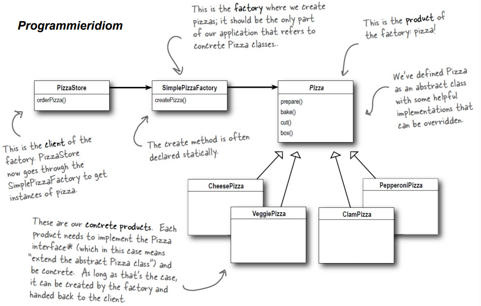
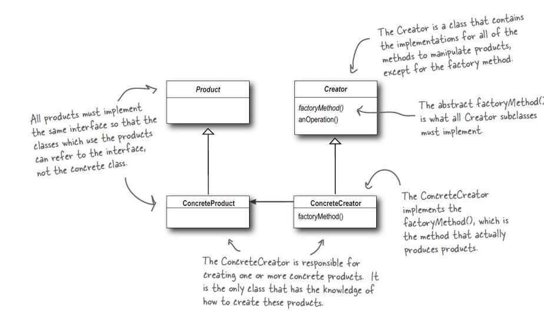
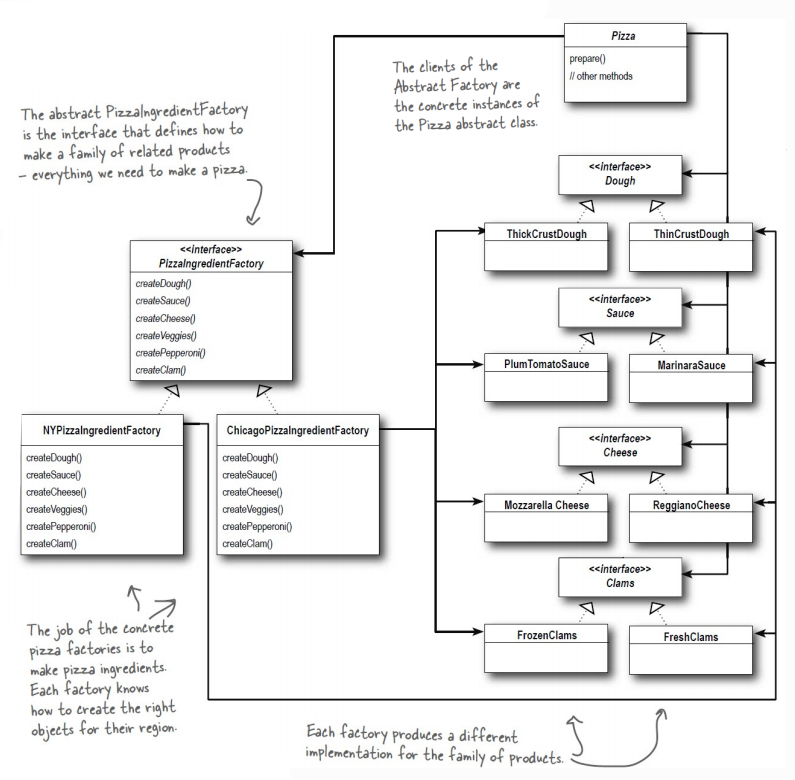

[back](README.md)

# Factory Pattern

Wie schon bekannt ist, gilt das Principle *program to an interface, not an implementation*. Allerdings brechen wir dieses jedes mal wenn wir *new* benutzen, da man hier eine konkrete Klasse angeben muss, da Interfaces und abstrakte Klassen nicht instanzierbar sind. Für dieses Problem gibt es nun mehrere Lösungsmöglichkeiten.

#### Simple Factory

Die erste vorgestellte Möglichkeit ist die Simple Factory, welche eigentlich kein richtiges Design Pattern ist, sondern nur ein Idiom (immer wieder auftauchndes Konstrukt). Z.B. haben wir eine Methode mit einem Parameter, wobei der Parameter das Objekt bestimmt. Allerdings können neue Objekte hinzu kommen, wie zum Beispiel neue Gerichte in einem Restaurant o.ä., wodurch man diese auch bei der Methode berücksichtigen muss. Dadurch haben wir Code, welcher sich ändern kann. Dieser sollte in einer anderen Klasse abgelegt werden, anstatt mit nicht-verändertem Code zusammen zu lassen.

In diesem Beispiel haben wir nun einen PizzaStore/Pizzeria, welcher Pizzen herstellt. Um nun den Code mit hoher Änderungswahrscheinlichkeit aus dem PizzaStore zu entfernen, können wir eine Factory erstellen, welche über die create-Methode verfügt und nach einem Parameter bestimmt, welche Pizza erstellt wird. Der Prozess der Bestellung wird sich nicht ändern, das Angebot der Pizzen wahrscheinlich schon.

<small>[Head First Design Patterns](http://shop.oreilly.com/product/9780596007126.do) Seite 119</small>

~~~ java
public class PizzaStore {
    SimplePizzaFactory factory;

    public PizzaStore(SimplePizzaFactory factory){
        this.factory = factory;
    }

    public Pizza orderPizza(String type){
        Pizza pizza;
        pizza = factory.createPizza(type);
        pizza.prepare();
        pizza.bake();
        pizza.cut();
        pizza.box();

        return pizza;
    }
}

public class SimplePizzaFactory {
    public Pizza createPizza(String type){
        Pizza pizza = null;

        if(type.equals("cheese")){
            pizza = new CheesePizza();
        } else if(type.equals("salami")){
            pizza = new SalamiPizza();
        } else if(type.equals("mistake")){
            pizza = new PineapplePizza();
        }
        return pizza;
    }
}

// Pizza ist abstrakt. Methoden: prepare, bake, cut und box (alle nicht abstrakt). Werden geändert bzw. können geändert werden.
~~~

### Factory Method

Bei dem Factory Method Pattern haben wir eine abstrakte Klasse (Creator/Factory), welche *factoryMethod* als abstrakte Methode besitzt. Außerdem kann die Klasse weitere Methoden haben, welche mit dem Ergebnis der *factoryMethod* arbeiten. In diesem Pattern "entscheiden" die Subklassen (von der Creator-Klasse -> konkrete Creator/Factory), welches konkrete Objekt erstellt wird. Mit "entscheiden" meint man hier, dass der Creator ohne Wissen über das eigentlich Ergebnis, geschrieben wurde und nicht weiß, womit genau er arbeiten wird.<small>Es wäre auch möglich eine Standardvariante der *factoryMethod* festzulegen.</small>

<small>[Head First Design Patterns](http://shop.oreilly.com/product/9780596007126.do) Seite 136</small>

Z.B. haben wir nun wieder einen PizzaStore (Creator), welcher mit Pizzen (abstrakte Klasse für das Produkt) arbeitet und nicht mit den konkreten Pizzen. Er bekommt zwar eine konkrete Pizza zum arbeiten, weiß aber nicht, welche Pizza es ist und dies braucht er auch nicht zu wissen. So lange alle wichtigen Methoden der Pizza in der abstrakten Klasse definiert wurden, kann er jede konkrete Pizza gleich behandeln.

Der PizzaStore ist beim Factory Method Pattern eine abstrakte Klasse mit createPizza als abstrakte Methode, welche von den konkreten Factories implementiert werden muss.

~~~ java
public abstract class PizzaStore {
    public Pizza orderPizza(String type) {
        Pizza pizza = createPizza(type);
        pizza.prepare();
        pizza.bake();
        pizza.cut();
        pizza.box();
        return pizza;
    }
    abstract Pizza createPizza(String type);
}
~~~

Die konkreten PizzaStores sind der Simple Factory ziemlich ähnlich. Auch hier wird die Erstellung basierend auf dem Parameter vollführt.

~~~ java
public class NYPizzaStore extends PizzaStore {
    Pizza createPizza(String item) {
        if (item.equals("cheese")) {
            return new NYStyleCheesePizza();
        } // ...
    }
}
public class ChicagoPizzaStore extends PizzaStore {
    Pizza createPizza(String item) {
        if (item.equals("cheese")) {
            return new ChicagoStyleCheesePizza();
        } // ...
    }
}
~~~

### Abstract Factory

Mit einer Abstract Factory hat man die Möglichkeit, Familien von Produkten bzw. Objekten zu erstellen. Wir haben also eine abstrakte Klasse, welche unsere Factory ist. In dieser werden die Methoden deklariert, welche für die Erstellung der einzelnen Prduktfamilienmitglieder zuständig sind. Die Subklassen dieser AbstractFactory kümmern sich um die Erzeugung der Objekte bzw. sie geben an welches konkrete Produkt erstellt wird. Somit kann man durch das Erzeugen einer der SubFactories bei einem Programm festlegen, welche Produkte es erhält. Oft wird für die konkreten Factories das Factory Method Pattern benutzt.
Bsp.: Wir haben wieder einen PizzaStore, allerdings schauen wir dieses mal auf die Zutaten. 1) Am Anfang erstellen wir ein Interface mit create-Methoden für die Zutaten wie Käse, Sauce, ... (PizzaIngredientFactory). All diese Zutaten gehören zu der *Zutatenfamilie*. 2) In den Subklassen werden nun die bereits definierten create-Methoden genutzt, um die jeweiligen Zutaten zu erstellen. 3) Nun wollen wir eine Margherita bzw. Käse Pizza. Wir übergeben der Käse Pizza-Klasse die jeweilige Subklassen-Factory und dann wird durch das Aufrufen der create-Methoden die richtige Zutatenfamilie erhalten.

1)
~~~ java
public interface PizzaIngredientFactory {
	public Dough createDough();
	public Sauce createSauce();
	public Cheese createCheese();
	public Veggies[] createVeggies();
	public Pepperoni createPepperoni();
}
~~~

2)
~~~ java
public class NYPizzaIngredientFactory implements PizzaIngredientFactory {
	public Dough createDough() {
		return new ThinCrustDough();
	}
	public Sauce createSauce() {
		return new MarinaraSauce();
	} // ...
}

public class ChicagoPizzaIngredientFactory implements PizzaIngredientFactory {
	public Dough createDough() {
		return new ThickCrustDough();
	}
	public Sauce createSauce() {
		return new PlumTomatoSauce();
	} // ...
}
~~~

3)
~~~ java
public class CheesePizza extends Pizza {
	PizzaIngredientFactory ingredientFactory;

	public CheesePizza(PizzaIngredientFactory ingredientFactory) {
		this.ingredientFactory = ingredientFactory;
	}
	void prepare() {
		System.out.println("Preparing " + getName());
		setDough(ingredientFactory.createDough());
		setSauce(ingredientFactory.createSauce());
		setCheese(ingredientFactory.createCheese());
	}
}
~~~

<small>[Head First Design Patterns](http://shop.oreilly.com/product/9780596007126.do) Seite 159</small>

### Factory Method vs. Abstract Factory

Der Unterschied zwischen diesen beiden ist, dass das Factory Method Pattern Subklassen benutzt, welche die Erstellung von konkreten Objekte für den Client übernehmen, damit dieser sich nur noch auf die abstrakte Klasse konzentirieren muss.
Währenddessen bietet bei Abstract Factory eine abstrakte Klasse Methoden bzw. Möglichkeiten um eine Familie von Produkten zu erzeugen. Die Art, wie diese Produkte erzeugt werden, wird dann von den konkreten Klassen festgelegt. Und um diese dann nutzen zu können, muss man eine konkrete Factory initialisieren und dann Code übergeben werden, welcher mithilfe der Factory die Produkte erstellt bzw. erhaltet.